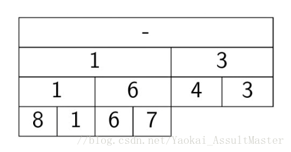

# 线段树(segment tree)、树状数组(bianary indexed tree)

[题目来源 ：NumArray][4]

实现：   
[SegmentTree.java](SegmentTree.java)

[BinaryIndexedTree.java](BinaryIndexedTree.java)

[QuickSumSlowUpdate.java](QuickSumSlowUpdate.java)

## 接口和适用范围

### 接口
| API                            | SegmentTree  | BinaryIndexedTree | QuickSum... |
| ------------------------------ | :----------: | :---------------: | :---------: |
| `Update(int index, Value val)` | $O(\log{n})$ |   $O(\log{n})$    |   $O(n)$    |
| `RangeSum(int i, int j)`       | $O(\log{n})$ |   $O(\log{n})$    |   $O(1)$    |
| `PrefixSum(int i)`             |      -       |   $O(\log{n})$    |      -      |

### 需求

根据时间复杂性，可大致知道个方法的适用情况：

- SegmentTree和BinaryIndexedTree都适合更新和查询次数 ***接近*** 的情况
- QuickSumSlowUpdate 正如名字所示……

## Segment Tree
线段树即使不是满二叉树，完全二叉树即可：    
对于 `[4,3,8,1,6,7]`

从下往上建立segment tree即可。

### 当年做[这个题目][4]的时候我想了一个递归的方法，而且用的是Node

## Reference
[1.树状数组](https://blog.csdn.net/Yaokai_AssultMaster/article/details/79492190)

[2.线段树](https://blog.csdn.net/Yaokai_AssultMaster/article/details/79599809)

[4]:file:///C:\Users\29388\Documents\code\LeetCode\src\main\java\mine\algo\num_array\NumArray.java